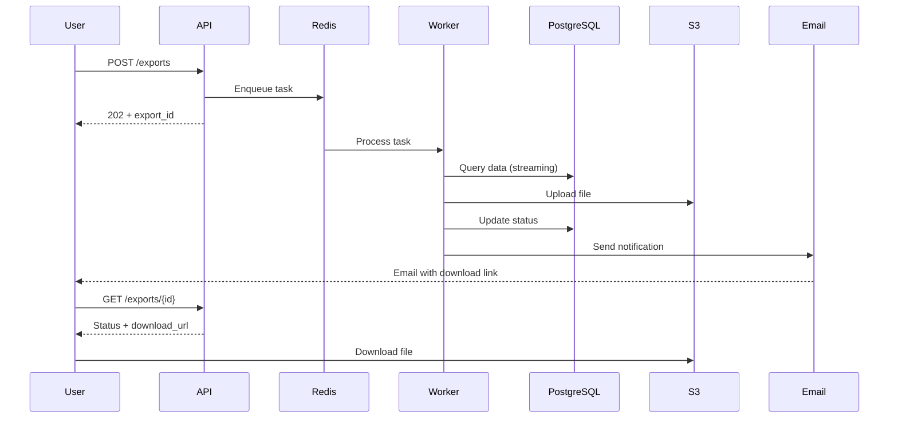

# Approach: Data Export Service

- **Author**: Bob Smith (Engineering Lead)
- **Status**: Approved
- **RFC**: [docs/rfc/rfc-001-export-architecture.md](../../docs/rfc/rfc-001-export-architecture.md)
- **Requirements**: [requirements.md](./requirements.md)

---

## 1. Overview

The export service provides async data export in CSV/JSON formats. Users request exports via API, tasks are queued and processed by Celery workers, files are stored in S3, and users receive email notifications with download links.

## 2. Architecture

### 2.1 Container Diagram

```plantuml
@startuml
!include https://raw.githubusercontent.com/plantuml-stdlib/C4-PlantUML/master/C4_Container.puml

System_Boundary(export, "Export Service") {
    Container(api, "Export API", "FastAPI", "Handles export requests")
    Container(worker, "Export Worker", "Celery", "Processes export tasks")
    ContainerDb(db, "Database", "PostgreSQL", "Export metadata")
    ContainerDb(redis, "Queue", "Redis", "Task queue")
}

System_Ext(s3, "S3", "File storage")
System_Ext(email, "SendGrid", "Email service")

Rel(api, redis, "Enqueues tasks")
Rel(redis, worker, "Delivers tasks")
Rel(worker, db, "Reads data")
Rel(worker, s3, "Uploads files")
Rel(worker, email, "Sends notifications")
@enduml
```

### 2.2 Data Flow (Happy Path)



### 2.3 Data Model

```sql
CREATE TABLE exports (
    id UUID PRIMARY KEY DEFAULT gen_random_uuid(),
    user_id UUID NOT NULL REFERENCES users(id),
    format VARCHAR(10) NOT NULL CHECK (format IN ('csv', 'json')),
    filters JSONB DEFAULT '{}',
    status VARCHAR(20) NOT NULL DEFAULT 'pending'
        CHECK (status IN ('pending', 'processing', 'completed', 'failed')),
    file_url TEXT,
    file_size BIGINT,
    progress_percent INTEGER DEFAULT 0,
    error_message TEXT,
    created_at TIMESTAMP DEFAULT NOW(),
    started_at TIMESTAMP,
    completed_at TIMESTAMP
);

CREATE INDEX idx_exports_user_status ON exports(user_id, status);
CREATE INDEX idx_exports_created_at ON exports(created_at);
```

## 3. API Contracts

### 3.1 POST /api/exports

**Request**:
```json
{
  "format": "csv",
  "filters": {
    "date_from": "2025-01-01",
    "date_to": "2025-12-31"
  }
}
```

**Response (202)**:
```json
{
  "export_id": "550e8400-e29b-41d4-a716-446655440000",
  "status": "pending",
  "status_url": "/api/exports/550e8400-e29b-41d4-a716-446655440000"
}
```

### 3.2 GET /api/exports/{id}

**Response (200)**:
```json
{
  "export_id": "550e8400-e29b-41d4-a716-446655440000",
  "status": "completed",
  "progress_percent": 100,
  "download_url": "/api/exports/550e8400/download",
  "file_size": 1048576,
  "expires_at": "2025-01-27T12:00:00Z",
  "created_at": "2025-01-20T10:00:00Z"
}
```

## 4. Key Design Decisions

### 4.1 Async Processing with Celery
**Choice**: Celery + Redis
**Why**: Mature, feature-rich, team experience
**Reference**: [ADR-001](../../docs/adr/adr-001-async-processing.md)

### 4.2 S3 for File Storage
**Choice**: AWS S3 with 7-day lifecycle
**Why**: Cheap, scalable, built-in lifecycle policies
**Reference**: [ADR-002](../../docs/adr/adr-002-s3-storage.md)

### 4.3 Streaming for Large Exports
**Choice**: Chunked processing (10,000 rows per chunk)
**Why**: Memory efficiency for large datasets
**Implementation**:
```python
def stream_export(export_id, chunk_size=10000):
    offset = 0
    while True:
        chunk = db.query(...).offset(offset).limit(chunk_size).all()
        if not chunk:
            break
        yield chunk
        offset += chunk_size
```

### 4.4 Progress Tracking
**Choice**: Polling-based (status endpoint)
**Why**: Simple, works with all clients
**Trade-off**: Not real-time, but acceptable for this use case

## 5. Error Handling

| Error Scenario | Handling |
|----------------|----------|
| Database connection failure | Retry 3x with exponential backoff |
| S3 upload timeout | Retry 3x, then fail task |
| Email service unavailable | Queue notification, retry for 24h |
| User account deleted during export | Complete export, then proceed with deletion |
| Export timeout (>30 min) | Retry once, notify on second failure |

## 6. Performance

| Scenario | Target | Strategy |
|----------|--------|----------|
| Small exports (<10K records) | <30s | Direct processing |
| Medium exports (10K-1M records) | <5 min | Chunked processing |
| Large exports (>1M records) | <30 min | Streaming + parallel |
| Concurrent exports | 1000 | Auto-scale workers |

## 7. Security

- **Encryption**: AES-256 at rest (S3 server-side)
- **Authentication**: JWT required for all endpoints
- **Authorization**: Users can only access own exports
- **Signed URLs**: Time-limited (7 days), authenticated
- **Audit**: Log all export requests (who, when, what)

## 8. Testing Strategy

| Level | Coverage | Tools |
|-------|----------|-------|
| Unit | Export service logic | pytest |
| Integration | API endpoints | httpx + pytest |
| E2E | Full export flow | Behave (BDD) |
| Performance | Load testing | Locust |

## 9. Out of Scope

- Real-time sync
- Import functionality
- Custom formats (XML, Parquet)
- Admin bulk exports

## References

- [RFC-001](../../docs/rfc/rfc-001-export-architecture.md)
- [Requirements](./requirements.md)
- [ADR-001](../../docs/adr/adr-001-async-processing.md)
- [ADR-002](../../docs/adr/adr-002-s3-storage.md)
