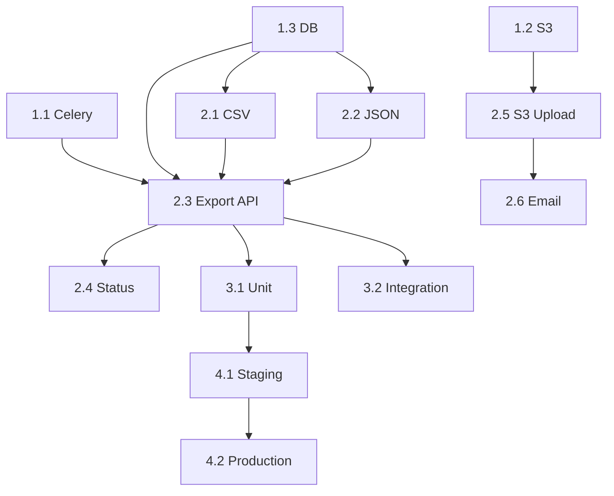

# Tasks: Data Export Service

- **Approach**: [approach.md](./approach.md)
- **Requirements**: [requirements.md](./requirements.md)
- **RFC**: [rfc-001](../../docs/rfc/rfc-001-export-architecture.md)

---

## Estimation Summary

| Phase | Tasks | Total Effort | Risk |
|-------|-------|--------------|------|
| Setup | 3 | 1.5 days | Low |
| Core Implementation | 6 | 6 days | Medium |
| Testing | 3 | 3 days | Medium |
| Deployment | 2 | 1 day | High |
| **Total** | **14** | **11.5 days** | |

---

## Phase 1: Setup & Infrastructure

### Task 1.1: Setup Celery worker infrastructure
- **Description**: Configure Celery with Redis broker
- **Acceptance Criteria**:
  - [ ] Celery configured with Redis broker
  - [ ] Worker process starts and connects
  - [ ] Health check endpoint responds
  - [ ] Structured JSON logging configured
- **Requirements**: REQ-EXP-005, REQ-EXP-026
- **Approach**: Section 4.1
- **Estimate**: S (2-4 hours)
- **Status**: ⬜

### Task 1.2: Setup S3 client
- **Description**: Configure S3 client for export files
- **Acceptance Criteria**:
  - [ ] S3 client initialized
  - [ ] Upload/download test passes
  - [ ] Lifecycle policy (7-day expiry)
  - [ ] AES-256 encryption configured
- **Requirements**: REQ-EXP-004, REQ-EXP-023
- **Approach**: Section 4.2
- **Estimate**: S (2-4 hours)
- **Status**: ⬜

### Task 1.3: Database migration
- **Description**: Create exports table
- **Acceptance Criteria**:
  - [ ] Migration script created
  - [ ] Schema matches design
  - [ ] Indexes created
  - [ ] Migration runs (up/down)
- **Requirements**: All
- **Approach**: Section 2.3
- **Estimate**: S (2-4 hours)
- **Status**: ⬜

---

## Phase 2: Core Implementation

### Task 2.1: CSV export handler
- **Description**: Handler that streams data as CSV
- **Acceptance Criteria**:
  - [ ] Accepts user_id and filters
  - [ ] Streams in chunks (10K rows)
  - [ ] Handles special characters
  - [ ] Memory < 512MB
  - [ ] Unit tests >80% coverage
- **Requirements**: REQ-EXP-001, REQ-EXP-020, REQ-EXP-021
- **Approach**: Section 4.3
- **Dependencies**: Task 1.3
- **Estimate**: M (1-2 days)
- **Status**: ⬜

### Task 2.2: JSON export handler
- **Description**: Handler that streams data as JSON
- **Acceptance Criteria**:
  - [ ] Streams in chunks
  - [ ] Valid JSON output
  - [ ] Unit tests >80% coverage
- **Requirements**: REQ-EXP-002, REQ-EXP-020
- **Approach**: Section 4.3
- **Dependencies**: Task 1.3
- **Estimate**: M (1-2 days)
- **Status**: ⬜

### Task 2.3: Export API endpoint
- **Description**: POST /api/exports
- **Acceptance Criteria**:
  - [ ] Accepts format and filters
  - [ ] Validates input
  - [ ] Creates export record
  - [ ] Enqueues Celery task
  - [ ] Returns 202 with export_id
  - [ ] Response time < 2 seconds
- **Requirements**: REQ-EXP-005
- **Approach**: Section 3.1
- **Dependencies**: Task 1.1, 1.3, 2.1, 2.2
- **Estimate**: M (1-2 days)
- **Status**: ⬜

### Task 2.4: Status endpoint
- **Description**: GET /api/exports/{id}
- **Acceptance Criteria**:
  - [ ] Returns current status
  - [ ] Returns download_url when completed
  - [ ] 404 for non-existent
  - [ ] 403 for other users' exports
- **Requirements**: REQ-EXP-009
- **Approach**: Section 3.2
- **Dependencies**: Task 2.3
- **Estimate**: S (2-4 hours)
- **Status**: ⬜

### Task 2.5: S3 upload with retry
- **Description**: Upload file with retry logic
- **Acceptance Criteria**:
  - [ ] Retry 3x with backoff
  - [ ] Set encryption headers
  - [ ] Generate signed URL
  - [ ] Update database
- **Requirements**: REQ-EXP-004, REQ-EXP-015
- **Approach**: Section 5
- **Dependencies**: Task 1.2
- **Estimate**: M (1-2 days)
- **Status**: ⬜

### Task 2.6: Email notification
- **Description**: Send email on completion
- **Acceptance Criteria**:
  - [ ] Email sent on success
  - [ ] Contains download link
  - [ ] Queue if service down
  - [ ] Retry for 24h
- **Requirements**: REQ-EXP-006, REQ-EXP-018
- **Approach**: Section 5
- **Dependencies**: Task 2.5
- **Estimate**: S (2-4 hours)
- **Status**: ⬜

---

## Phase 3: Testing

### Task 3.1: Unit tests
- **Estimate**: M (1-2 days)
- **Status**: ⬜

### Task 3.2: Integration tests
- **Estimate**: M (1-2 days)
- **Status**: ⬜

### Task 3.3: Performance tests
- **Estimate**: M (1-2 days)
- **Status**: ⬜

---

## Phase 4: Deployment

### Task 4.1: Deploy to staging
- **Estimate**: S (2-4 hours)
- **Status**: ⬜

### Task 4.2: Production rollout
- **Estimate**: S (2-4 hours) + monitoring
- **Status**: ⬜

---

## Dependency Graph

