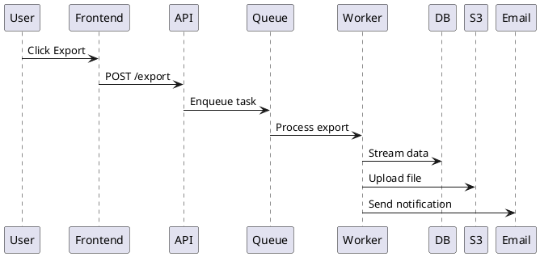

# Модульный подход к процессам разработки

## Введение

Жёсткие pipelines (Full, Lightweight, BDD, etc.) — это **упрощение**. В реальности процессы должны быть **модульными** — мы собираем их из строительных блоков в зависимости от:
- Сложности задачи
- Уровня неопределённости
- Доступного времени
- Критичности системы
- Размера команды

**Ключевая идея**: не выбирайте pipeline — **соберите его** из нужных модулей.

---

## Building Blocks (Строительные блоки)

### Core Blocks (Обязательные для большинства проектов)

#### 1. Problem Statement
**Что**: Краткое описание проблемы (1-2 абзаца)
**Когда**: Всегда в начале
**Кто**: Любой участник
**Формат**: Markdown
**Хранение**: В начале spec/RFC/PRD

**Пример**:
```markdown
## Problem
Users currently cannot export their data, which violates GDPR requirements 
and prevents users from migrating to competitors. This blocks enterprise 
customers who require data portability.
```

**Используется в**: Все pipelines

---

#### 2. Requirements (Требования)
**Что**: Структурированные требования к системе
**Когда**: После problem statement
**Кто**: Product Manager / Engineer / AI
**Формат**: EARS notation
**Хранение**: `specs/requirements.md` или inline в spec

**Форматы**:
- **EARS** (рекомендуется): `When <trigger>, the system shall <response>`
- **User Stories**: `As a <user>, I want <goal>, so that <benefit>`
- **Job Stories**: `When <situation>, I want to <motivation>, so I can <outcome>`

**Пример (EARS)**:
```markdown
## Requirements

### Ubiquitous
- REQ-1: The system shall support CSV export format
- REQ-2: The system shall support JSON export format

### Event-driven
- REQ-3: When user clicks "Export", the system shall generate export file within 30 seconds
- REQ-4: When export completes, the system shall send email notification with download link

### State-driven
- REQ-5: While export is in progress, the system shall display progress bar
- REQ-6: While export size > 1GB, the system shall use streaming approach
```

**Используется в**: Все pipelines (обязательно)

---

#### 3. Approach (Подход к реализации)
**Что**: High-level описание как будем реализовывать
**Когда**: После requirements
**Кто**: Engineer / Architect
**Формат**: Markdown + диаграммы
**Хранение**: `specs/design.md` или inline в spec

**Содержит**:
- Technology choices
- Architecture decisions
- Data flow
- Key components
- Integration points

**Пример**:
```markdown
## Approach

### Technology Stack
- Backend: Python (FastAPI)
- Queue: Redis + Celery
- Storage: S3 for export files
- Email: SendGrid API

### Architecture


### Key Decisions
- Use streaming for large exports (>1GB)
- Async processing via queue
- Files expire after 7 days
```

**Используется в**: Все pipelines (обязательно)

---

#### 4. Tasks Breakdown (Разбиение на задачи)
**Что**: Список implementable tasks
**Когда**: После approach
**Кто**: Engineer / AI
**Формат**: Markdown checkboxes / Jira tickets
**Хранение**: `specs/tasks.md` или issue tracker

**Пример**:
```markdown
## Tasks

### Phase 1: Core Infrastructure
- [ ] Task 1.1: Create Celery worker service
- [ ] Task 1.2: Setup S3 client configuration
- [ ] Task 1.3: Implement task queueing mechanism

### Phase 2: Export Logic
- [ ] Task 2.1: Implement CSV export handler
- [ ] Task 2.2: Implement JSON export handler
- [ ] Task 2.3: Add streaming support for large datasets

### Phase 3: User Interface
- [ ] Task 3.1: Create export endpoint (POST /export)
- [ ] Task 3.2: Add progress tracking endpoint (GET /export/{id}/status)
- [ ] Task 3.3: Implement email notification

### Phase 4: Testing & Deployment
- [ ] Task 4.1: Write unit tests
- [ ] Task 4.2: Write integration tests
- [ ] Task 4.3: Update API documentation
- [ ] Task 4.4: Deploy to staging
```

**Используется в**: Все pipelines (обязательно)

---

#### 5. Implementation (Реализация)
**Что**: Написание кода
**Когда**: После tasks breakdown
**Кто**: Engineer / AI
**Формат**: Source code
**Хранение**: `src/`, `tests/`

**Используется в**: Все pipelines (обязательно)

---

#### 6. ADR (Architecture Decision Record)
**Что**: Фиксация архитектурного решения
**Когда**: Когда принято важное решение
**Кто**: Engineer / Architect
**Формат**: MADR или Nygard
**Хранение**: `docs/adr/adr-NNN.md`

**Когда создавать ADR**:
- Выбран technology stack
- Выбран architectural pattern
- Выбран external service
- Выбран data model
- Решение влияет на multiple components

**Пример**:
```markdown
# ADR 004: Use Celery for async task processing

## Context
Need to handle long-running export operations (>30 seconds) without 
blocking API responses.

## Decision Drivers
- Tasks can take 10 seconds to 1 hour
- Need retry mechanism for failures
- Must scale horizontally
- Team has Python expertise

## Considered Options
- Celery + Redis
- RQ (Redis Queue)
- AWS SQS + Lambda
- Custom background workers

## Decision Outcome
Chosen option: "Celery + Redis", because:
- Mature, battle-tested solution
- Rich feature set (retries, scheduling, monitoring)
- Good Python integration
- Easy to deploy and scale

### Consequences
* Good: Well-documented, large community
* Good: Flower UI for monitoring
* Bad: Additional infrastructure (Redis)
* Bad: Learning curve for advanced features

## More Information
- [Celery Documentation](https://docs.celeryq.dev)
- [ADR-002](./adr-002-use-redis-for-caching.md) - Redis already in use
```

**Используется в**: Все pipelines (когда есть architectural decisions)

---

### Optional Modules (Опциональные, добавляются по необходимости)

#### 7. PRD (Product Requirements Document)
**Что**: Product-level requirements (what & why)
**Когда**: Новая продуктовая линия / major feature
**Кто**: Product Manager
**Формат**: Markdown
**Хранение**: `docs/prd/`

**Добавлять когда**:
- Новая продуктовая линейка
- Feature затрагивает multiple teams
- Нужен product alignment
- Budget > $100k
- Duration > 1 month

**Не добавлять когда**:
- Bug fix
- Small enhancement
- Internal tooling
- One team works on feature

**Содержит**:
- Problem statement
- Goals & non-goals
- Success metrics
- User stories
- Constraints & assumptions
- Open questions

**Используется в**: Full Pipeline, Product-driven projects

---

#### 8. RFC (Request for Comments)
**Что**: Technical proposal с alternatives
**Когда**: Нужен consensus / architectural debate
**Кто**: Engineer
**Формат**: Markdown
**Хранение**: `docs/rfc/`

**Добавлять когда**:
- Multiple viable alternatives
- Cross-team impact
- High-risk decision
- Reversible vs irreversible choice
- Нужен team alignment

**Не добавлять когда**:
- Решение очевидно
- Нет alternatives
- Low impact
- Time pressure

**Содержит**:
- Context / problem
- Proposal
- Alternatives considered (с pros/cons)
- Trade-offs and risks
- Open questions

**Используется в**: RFC-First Pipeline, Complex decisions

---

#### 9. BDD Scenarios (Behavior-Driven Development)
**Что**: Executable specifications в Given-When-Then
**Когда**: Business rules critical / compliance
**Кто**: Team (Product + Dev + QA)
**Формат**: Gherkin
**Хранение**: `features/*.feature`

**Добавлять когда**:
- Business rules critical (finance, healthcare, legal)
- Regulatory compliance (GDPR, HIPAA, SOX)
- Complex user workflows
- Stakeholder collaboration важна
- Нужна executable documentation

**Не добавлять когда**:
- Simple CRUD operations
- Internal technical features
- No business stakeholders
- Time pressure

**Пример**:
```gherkin
Feature: Data export
  Background:
    Given user "alice" exists with 1000 records
    
  Rule: Export formats
    Scenario: Export data as CSV
      When alice requests CSV export
      Then export file is generated in CSV format
      And file contains header row
      And file contains 1000 data rows
    
    Scenario: Export data as JSON
      When alice requests JSON export
      Then export file is generated in JSON format
      And file contains valid JSON array
      And array contains 1000 objects
  
  Rule: Large exports
    Scenario: Export > 1GB uses streaming
      Given user "bob" exists with 10 million records
      When bob requests CSV export
      Then system uses streaming approach
      And memory usage stays below 512MB
      And export completes within 30 minutes
```

**Используется в**: BDD Pipeline, Compliance-critical projects

---

#### 10. Event Storming
**Что**: Workshop для domain discovery
**Когда**: Complex domain / new project
**Кто**: Team + domain experts
**Формат**: Sticky notes (physical или Miro)
**Хранение**: `docs/discovery/event-storming/`

**Добавлять когда**:
- Complex business domain
- New project (greenfield)
- Team не понимает domain
- Нужен shared understanding
- Multiple stakeholders

**Не добавлять когда**:
- Simple domain
- Team уже знает domain
- Time pressure
- Remote team без good tools

**Результат**:
- Domain events
- Commands
- Aggregates
- Policies
- Bounded contexts

**Используется в**: Domain-driven design projects, Complex systems

---

#### 11. User Story Mapping
**Что**: Visual organization user stories
**Когда**: Product discovery / prioritization
**Кто**: Product Manager + Team
**Формат**: Visual map (physical или Miro)
**Хранение**: `docs/discovery/story-map/`

**Добавлять когда**:
- Нужен holistic view продукта
- Prioritization сложная
- Multiple user journeys
- Release planning

**Не добавлять когда**:
- Single feature
- Clear priorities
- Small backlog

**Результат**:
- User activities
- User tasks
- User stories (по приоритетам)
- Release slices

**Используется в**: Product discovery, Release planning

---

#### 12. Design-First (Technical Design)
**Что**: Technical design перед requirements
**Когда**: Technical constraints / performance-critical
**Кто**: Engineer / Architect
**Формат**: Markdown + C4 diagrams
**Хранение**: `docs/design/`

**Добавлять когда**:
- Technical constraints определяют решение
- Performance-critical system
- Legacy system modernization
- Integration с external systems
- Infrastructure as code

**Не добавлять когда**:
- Product-driven feature
- User experience primary concern
- Simple implementation

**Содержит**:
- Technical constraints
- Solution strategy
- C4 diagrams (System Context, Container, Component)
- Data models
- API contracts
- Deployment architecture

**Используется в**: Design-First Pipeline, Technical projects

---

#### 13. Formal Methods (TLA+, FizzBee, Alloy)
**Что**: Mathematical specification и verification
**Когда**: Correctness critical / distributed systems
**Кто**: Engineer с expertise
**Формат**: TLA+ / FizzBee / Alloy
**Хранение**: `specs/formal/`

**Добавлять когда**:
- Correctness critical (auth, payments, consensus)
- Distributed systems
- Concurrent algorithms
- Safety-critical systems
- Нужно prove correctness

**Не добавлять когда**:
- Simple CRUD
- Time pressure
- No formal methods expertise
- Low risk

**Используется в**: Critical systems, Distributed systems

---

#### 14. API Specifications (OpenAPI, AsyncAPI, GraphQL)
**Что**: Formal API contracts
**Когда**: API development / integration
**Кто**: Engineer
**Формат**: YAML / JSON
**Хранение**: `specs/api/`

**Добавлять когда**:
- REST API development
- Event-driven architecture
- GraphQL API
- Integration с external systems
- Multiple consumers

**Не добавлять когда**:
- Internal functions
- No API
- Single consumer

**Пример (OpenAPI)**:
```yaml
openapi: 3.0.0
info:
  title: Export API
  version: 1.0.0
paths:
  /export:
    post:
      summary: Request data export
      requestBody:
        content:
          application/json:
            schema:
              type: object
              properties:
                format:
                  type: string
                  enum: [csv, json]
                filters:
                  type: object
      responses:
        '202':
          description: Export accepted
          content:
            application/json:
              schema:
                type: object
                properties:
                  export_id:
                    type: string
                  status_url:
                    type: string
```

**Используется в**: API-first development, Microservices

---

#### 15. Research Compendium
**Что**: Reproducible research structure
**Когда**: Data science / ML / research
**Кто**: Researcher / Data Scientist
**Формат**: Structured folders
**Хранение**: `compendium/`

**Добавлять когда**:
- Data science project
- ML model training
- Research и experimentation
- Reproducibility required
- Academic publication

**Не добавлять когда**:
- Production code
- Operational systems
- No data analysis

**Структура**:
```
compendium/
├── data/
│   ├── raw/
│   └── clean/
├── code/
├── figures/
├── paper.Rmd
├── Dockerfile
└── README.md
```

**Используется в**: Research projects, Data science

---

## Composition Rules (Правила компоновки)

### Rule 1: Core Blocks Always Present
**Problem Statement + Requirements + Approach + Tasks + Implementation** — всегда присутствуют в любом процессе.

### Rule 2: ADR for Decisions
Создавайте ADR **каждый раз**, когда принимаете architectural decision, независимо от pipeline.

### Rule 3: Add Optional Modules Based on Context

**Добавляйте модули когда**:

| Модуль | Добавлять когда |
|--------|----------------|
| **PRD** | Product-driven, multiple teams, budget > $100k |
| **RFC** | Need consensus, multiple alternatives, cross-team impact |
| **BDD** | Business rules critical, compliance, complex workflows |
| **Event Storming** | Complex domain, new project, team learning domain |
| **User Story Mapping** | Product discovery, prioritization, release planning |
| **Design-First** | Technical constraints, performance-critical, integration |
| **Formal Methods** | Correctness critical, distributed systems, safety-critical |
| **API Specs** | API development, microservices, external integration |
| **Research Compendium** | Data science, ML, research, reproducibility |

### Rule 4: Order Matters
Некоторые модули должны идти в определённом порядке:

```
PRD → RFC → Requirements → Design → Tasks → Implementation → ADR
         ↑                           ↑
    (before design)          (after approach)
```

**Правильный порядок**:
1. PRD (если нужен) — устанавливает what & why
2. Event Storming / User Story Mapping (если нужны) — discovery
3. RFC (если нужен) — technical proposal
4. Requirements — что система должна делать
5. Design / Design-First — как система будет устроена
6. API Specs (если нужны) — formal contracts
7. BDD Scenarios (если нужны) — executable specs
8. Tasks — breakdown на implementable pieces
9. Implementation — код
10. ADR (по мере принятия решений) — фиксация решений

### Rule 5: Skip What You Don't Need
Не добавляйте модули "на всякий случай". Каждый модуль должен иметь clear value.

**Bad**: Добавляем RFC для bug fix
**Good**: Добавляем RFC для architectural decision

---

## Composition Examples (Примеры компоновки)

### Example 1: Bug Fix (Minimal)
**Context**: Fix typo в UI
**Blocks**:
```
Problem Statement → Implementation → Commit message
```
**Modules**:
- ✅ Problem Statement (в commit message)
- ✅ Implementation
- ❌ Requirements (не нужны)
- ❌ Approach (очевидно)
- ❌ Tasks (один task)
- ❌ ADR (нет architectural decision)

**Результат**: Git commit с clear message

---

### Example 2: Small Feature (Lightweight SDD)
**Context**: Добавить новый API endpoint
**Blocks**:
```
Problem Statement → Requirements → Approach → Tasks → Implementation → ADR
```
**Modules**:
- ✅ Problem Statement
- ✅ Requirements (EARS)
- ✅ Approach (tech choices)
- ✅ Tasks (breakdown)
- ✅ Implementation
- ✅ ADR (если выбрали library/framework)

**Результат**: Spec file + code + ADR (если нужно)

---

### Example 3: Major Feature (Full Pipeline)
**Context**: Новая продуктовая линейка
**Blocks**:
```
PRD → Event Storming → RFC → Requirements → Design → API Specs → BDD → Tasks → Implementation → ADR (multiple)
```
**Modules**:
- ✅ PRD (product alignment)
- ✅ Event Storming (domain discovery)
- ✅ RFC (architectural debate)
- ✅ Requirements (EARS)
- ✅ Design (C4 + Arc42)
- ✅ API Specs (OpenAPI)
- ✅ BDD (business rules)
- ✅ Tasks (breakdown)
- ✅ Implementation
- ✅ ADR (multiple decisions)

**Результат**: Complete documentation suite + code

---

### Example 4: API Development (API-First)
**Context**: Новый микросервис
**Blocks**:
```
Problem Statement → API Specs → Requirements → Design → Tasks → Implementation → ADR
```
**Modules**:
- ✅ Problem Statement
- ✅ API Specs (OpenAPI first)
- ✅ Requirements (derived from API)
- ✅ Design (implementation details)
- ✅ Tasks
- ✅ Implementation
- ✅ ADR

**Результат**: API contract + implementation

---

### Example 5: Data Science Project (Research)
**Context**: ML model для predictions
**Blocks**:
```
Problem Statement → Research Compendium → Implementation → Paper
```
**Modules**:
- ✅ Problem Statement
- ✅ Research Compendium (structure)
- ✅ Implementation (code + data)
- ✅ Paper (documentation)
- ❌ Requirements (exploratory)
- ❌ Design (iterative)

**Результат**: Reproducible research compendium

---

### Example 6: Critical System (Formal Methods)
**Context**: Distributed consensus algorithm
**Blocks**:
```
Problem Statement → Formal Spec → Requirements → Design → Tasks → Implementation → ADR
```
**Modules**:
- ✅ Problem Statement
- ✅ Formal Spec (TLA+/FizzBee)
- ✅ Requirements (derived from formal spec)
- ✅ Design
- ✅ Tasks
- ✅ Implementation
- ✅ ADR

**Результат**: Mathematically verified system

---

## Decision Tree: Как собрать process

```
Начните с вопроса: "Что я делаю?"

├─ Bug fix / small change
│  └─ Core only: Problem → Implementation → Commit
│
├─ Feature (1-4 недели)
│  ├─ Нужен product alignment?
│  │  └─ Да → +PRD
│  │
│  ├─ Нужен technical debate?
│  │  └─ Да → +RFC
│  │
│  ├─ Business rules critical?
│  │  └─ Да → +BDD
│  │
│  ├─ API development?
│  │  └─ Да → +API Specs
│  │
│  └─ Core: Problem → Requirements → Approach → Tasks → Implementation → ADR
│
├─ Major feature / new product (> 1 месяц)
│  ├─ Complex domain?
│  │  └─ Да → +Event Storming
│  │
│  ├─ Product discovery needed?
│  │  └─ Да → +User Story Mapping
│  │
│  ├─ Technical constraints?
│  │  └─ Да → +Design-First
│  │
│  └─ Full: PRD → Discovery → RFC → Requirements → Design → Specs → BDD → Tasks → Implementation → ADRs
│
├─ Data science / research
│  └─ Research: Problem → Compendium → Implementation → Paper
│
└─ Critical system
   └─ Formal: Problem → Formal Spec → Requirements → Design → Tasks → Implementation → ADR
```

---

## Anti-patterns

### ❌ Over-composition
**Проблема**: Добавление всех модулей "на всякий случай"
**Результат**: Process paralysis, documentation debt
**Решение**: Add modules only when they provide clear value

### ❌ Under-composition
**Проблема**: Пропуск важных модулей (например, RFC для architectural decision)
**Результат**: Poor decisions, rework, team misalignment
**Решение**: Follow decision tree, don't skip critical modules

### ❌ Wrong order
**Проблема**: Design before requirements, или implementation before spec
**Результат**: Rework, wasted effort
**Решение**: Follow composition rules for order

### ❌ Module without purpose
**Проблема**: Добавление BDD для simple CRUD без business rules
**Результат**: Overhead без value
**Решение**: Each module must solve specific problem

---

## Comparison: Pipelines vs Modular

| Аспект | Жёсткие pipelines | Модульный подход |
|--------|-------------------|------------------|
| **Гибкость** | Низкая (выбираете один) | Высокая (собираете из блоков) |
| **Адаптивность** | Средняя (7 вариантов) | Высокая (бесконечные комбинации) |
| **Простота** | Высокая (clear choice) | Средняя (нужно понимать блоки) |
| **Overhead** | Может быть high | Optimized (только нужное) |
| **Learning curve** | Низкая (выбрать pipeline) | Средняя (понять блоки) |
| **Risk** | One-size-fits-all | Requires judgment |

**Рекомендация**: Используйте модульный подход для зрелых команд, pipelines для новых команд.

---

## Implementation Guide

### Step 1: Identify Your Context
- Size: small / medium / large
- Complexity: simple / complex / critical
- Time: hours / days / weeks / months
- Team: 1 person / small team / multiple teams

### Step 2: Start with Core Blocks
Always include:
- Problem Statement
- Requirements (EARS)
- Approach
- Tasks
- Implementation

### Step 3: Add Optional Modules
Use decision tree to add modules based on context.

### Step 4: Follow Order
Respect composition rules for order.

### Step 5: Create ADRs
Document architectural decisions as you make them.

### Step 6: Iterate
Adjust process as project evolves.

---

## Summary

**Ключевые принципы модульного подхода**:

1. **Core always present**: Problem → Requirements → Approach → Tasks → Implementation
2. **Add modules based on context**: PRD, RFC, BDD, etc.
3. **Order matters**: Follow composition rules
4. **Skip what you don't need**: Don't add modules "just in case"
5. **ADR for decisions**: Always document architectural decisions

**Преимущества**:
- ✅ Гибкость — собираете процесс под задачу
- ✅ Эффективность — нет лишнего overhead
- ✅ Масштабируемость — процесс растёт с проектом
- ✅ Adaptability — легко менять под context

**Недостатки**:
- ❌ Требует judgment — нужно понимать когда что добавлять
- ❌ Learning curve — нужно знать все блоки
- ❌ Risk of under/over-composition — нужен experience

**Рекомендация**: Начните с pipelines (process-variants.md), затем переходите к модульному подходу по мере зрелости команды.

---

## References

- [Process Variants](./process-variants.md) - жёсткие pipelines
- [Goals](./goals.md) - цели процессов
- [Knowledge Base](./knowledge-base.md) - все инструменты и подходы
- [EARS Notation](../../ears-notation.md) - для requirements
- [ADR Standards](../../adr-standards.md) - для decision records
- [SDD Landscape](../../sdd-landscape.md) - для spec-driven development
