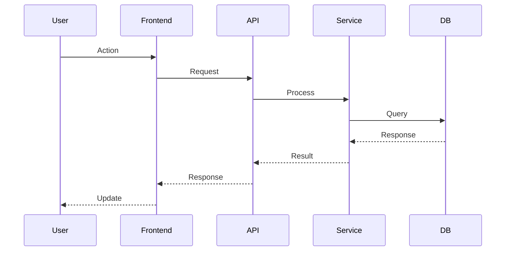
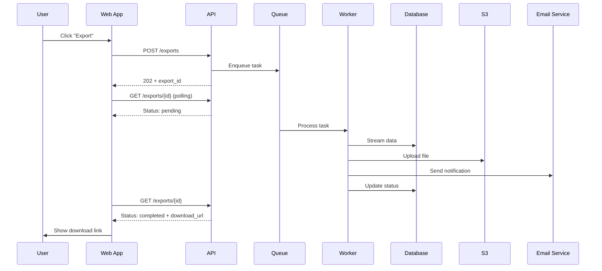
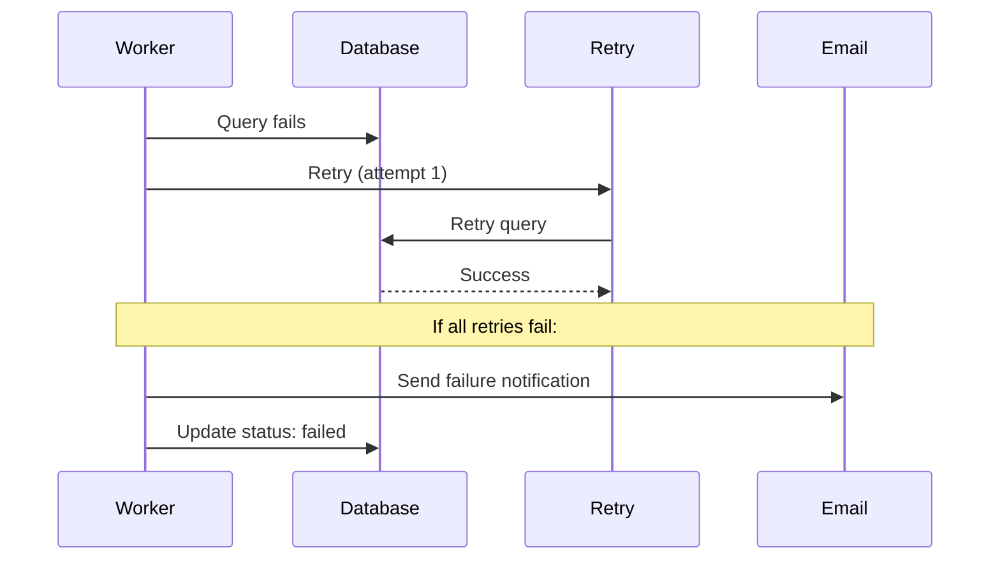
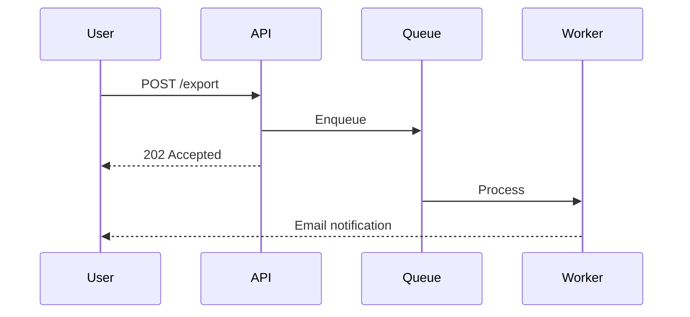
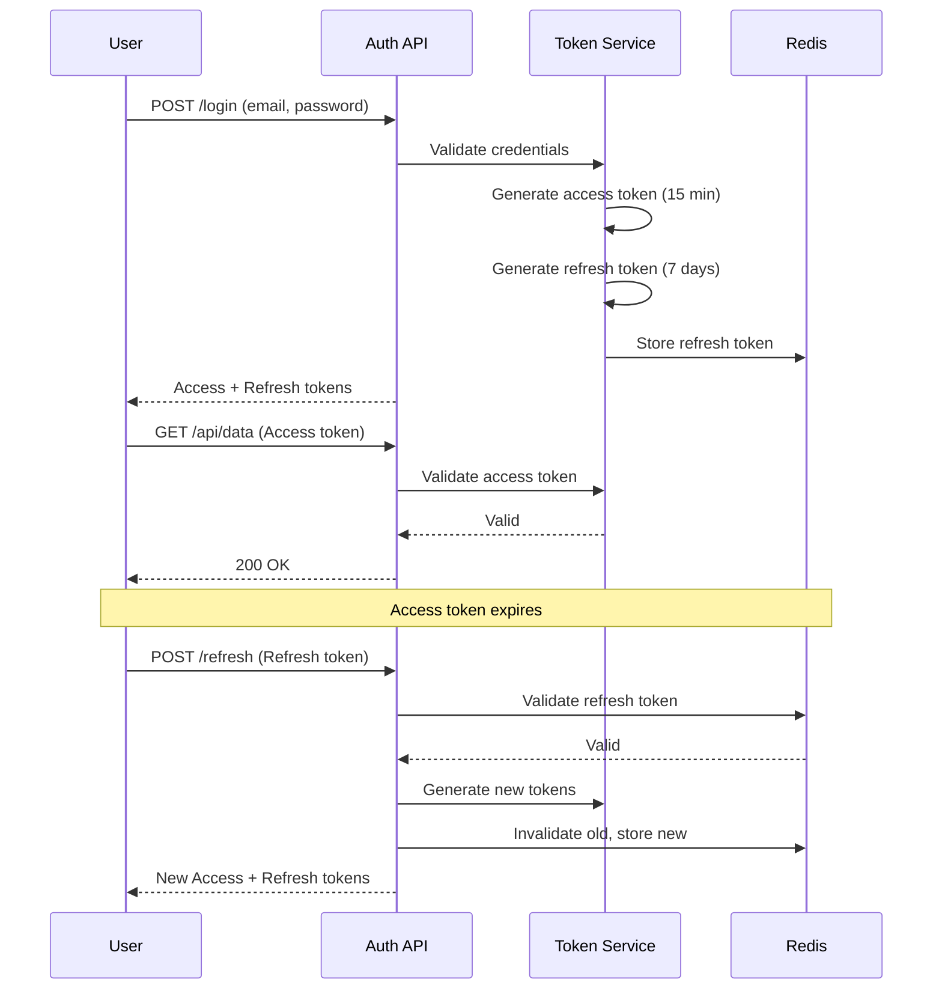

# Approach (Technical Design)

Первый модуль **Execution Flow** (Phase 2). Approach описывает **как** мы будем реализовывать систему, связывая требования (что делать) с кодом (реализация).

---

## Что такое Approach

**Approach** — это технический план, который отвечает на вопросы:
- **Как** система будет устроена?
- **Какие компоненты** будут взаимодействовать?
- **Какие технологии** мы используем?
- **Как данные** будут течь через систему?
- **Как мы обработаем** ошибки и edge cases?

**Это НЕ**:
- Архитектурное решение (это ADR)
- Список задач (это Tasks)
- Код (это Implementation)
- RFC (это proposal с alternatives)

**Это**:
- Мост между Requirements и Implementation
- Техническая спецификация для одного feature/change
- Руководство для разработчиков (людей и AI-агентов)
- Source of truth для верификации реализации

---

## Когда создавать Approach

### Обязательно создавать Approach когда:

1. **Feature 1+ неделя работы**
   - Multiple components affected
   - Non-trivial implementation
   - Cross-system integration

2. **Технически сложная задача**
   - Performance-critical paths
   - Complex data flows
   - Integration с external systems
   - Concurrency/parallelism

3. **AI-agent генерирует код**
   - AI needs clear technical spec
   - Multiple implementation options
   - Нужна верификация correctness

### НЕ создавать Approach когда:

- ❌ Trivial changes (typo fix, color change)
- ❌ One-line bug fixes
- ❌ Config changes
- ❌ Dependency updates

**Правило**: Если задача занимает больше одного context window AI-агента или одного рабочего дня разработчика — нужен Approach.

---

## Структура Approach

### Lightweight Template (для small features)

```markdown
# Approach: <Feature Name>

## Overview
[1-2 абзаца: что делаем и high-level подход]

## Architecture

### Components
- **Component A**: [what it does, key responsibilities]
- **Component B**: [what it does, key responsibilities]

### Data Flow


## Key Design Decisions

### 1. <Decision title>
- **Choice**: [what we chose]
- **Why**: [rationale]
- **Alternatives considered**: [what else we considered]
- **Trade-offs**: [what we gain and lose]

## Error Handling
- [Error scenario 1]: [how we handle it]
- [Error scenario 2]: [how we handle it]

## Performance Considerations
- [Performance concern 1]: [how we address it]
- [Performance concern 2]: [how we address it]

## Security Considerations
- [Security concern 1]: [how we address it]

## Testing Strategy
- **Unit tests**: [what we test at unit level]
- **Integration tests**: [what we test at integration level]
- **E2E tests**: [what we test end-to-end]

## Out of Scope
- [What we're explicitly NOT doing]
```

### Full Template (для major features)

```markdown
# Approach: <Feature Name>

## Metadata
- **Author**: <name>
- **Status**: Draft | In Review | Approved
- **Created**: <date>
- **Last Updated**: <date>
- **Requirements**: [link to requirements.md]
- **Related ADRs**: [links to relevant ADRs]
- **Related RFCs**: [links to relevant RFCs if any]

## 1. Overview
[Executive summary: what, why, high-level how]

## 2. Architecture

### 2.1 System Context
```plantuml
@startuml
!include https://raw.githubusercontent.com/plantuml-stdlib/C4-PlantUML/master/C4_Context.puml

Person(user, "User", "End user")
System(system, "System Name", "Brief description")
System_Ext(external, "External System", "Third-party API")

Rel(user, system, "Uses", "HTTPS")
Rel(system, external, "Calls", "REST API")
@enduml
```

### 2.2 Container Diagram
```plantuml
@startuml
!include https://raw.githubusercontent.com/plantuml-stdlib/C4-PlantUML/master/C4_Container.puml

System_Boundary(sys, "System") {
    Container(web, "Web App", "React", "User interface")
    Container(api, "API", "FastAPI", "Business logic")
    ContainerDb(db, "Database", "PostgreSQL", "Data storage")
    Container(queue, "Queue", "Redis", "Async tasks")
}

Rel(web, api, "Calls", "REST")
Rel(api, db, "Reads/Writes", "SQL")
Rel(api, queue, "Enqueues", "Jobs")
@enduml
```

### 2.3 Component Diagram
[Component diagram для critical containers]

### 2.4 Data Model
```sql
-- Key entities and relationships
CREATE TABLE users (
    id UUID PRIMARY KEY,
    email VARCHAR(255) UNIQUE NOT NULL,
    created_at TIMESTAMP DEFAULT NOW()
);

CREATE TABLE exports (
    id UUID PRIMARY KEY,
    user_id UUID REFERENCES users(id),
    status VARCHAR(50) DEFAULT 'pending',
    file_url TEXT,
    created_at TIMESTAMP DEFAULT NOW(),
    completed_at TIMESTAMP
);

CREATE INDEX idx_exports_user_status ON exports(user_id, status);
```

## 3. API Contracts

### 3.1 REST Endpoints

#### POST /api/exports
**Request**:
```json
{
  "format": "csv",
  "filters": {
    "date_from": "2025-01-01",
    "date_to": "2025-12-31"
  }
}
```

**Response (202 Accepted)**:
```json
{
  "export_id": "uuid-123",
  "status": "pending",
  "status_url": "/api/exports/uuid-123"
}
```

#### GET /api/exports/{id}
**Response (200 OK)**:
```json
{
  "export_id": "uuid-123",
  "status": "completed",
  "download_url": "/api/exports/uuid-123/download",
  "file_size": 1048576,
  "expires_at": "2025-01-22T12:00:00Z"
}
```

### 3.2 Event Contracts (if event-driven)
```yaml
# AsyncAPI
asyncapi: '2.6.0'
info:
  title: Export Events
  version: 1.0.0
channels:
  export.completed:
    subscribe:
      message:
        payload:
          type: object
          properties:
            export_id:
              type: string
            user_id:
              type: string
            download_url:
              type: string
```

## 4. Key Design Decisions

### 4.1 Async Processing with Celery
- **Choice**: Use Celery + Redis for async task processing
- **Why**: 
  - Export operations can take 10s to 1 hour
  - Need retry mechanism for failures
  - Must scale horizontally
- **Alternatives considered**:
  - RQ (simpler but fewer features)
  - AWS SQS + Lambda (15-min timeout limit)
  - Custom workers (reinventing the wheel)
- **Trade-offs**:
  - Good: Mature, battle-tested, rich features
  - Bad: Operational complexity, learning curve
- **Reference**: [ADR-003: Use Celery](../adr/adr-003.md)

### 4.2 File Storage Strategy
- **Choice**: Use S3 for export files with 7-day expiration
- **Why**:
  - Cheap object storage
  - Built-in lifecycle policies
  - No need to manage disk space
- **Alternatives considered**:
  - Local filesystem (doesn't scale, single point of failure)
  - Database BLOBs (expensive, slow)
  - EFS/NFS (complex, expensive)
- **Trade-offs**:
  - Good: Scalable, cheap, reliable
  - Bad: Network latency, S3 costs at scale

### 4.3 Progress Tracking
- **Choice**: Polling-based with status endpoint
- **Why**:
  - Simple to implement
  - Works with all clients
  - No WebSocket complexity
- **Alternatives considered**:
  - WebSockets (real-time but complex)
  - Server-Sent Events (not universally supported)
  - Push notifications (overkill)
- **Trade-offs**:
  - Good: Simple, universal
  - Bad: Not real-time, polling overhead

## 5. Data Flow

### 5.1 Happy Path


### 5.2 Error Path


## 6. Error Handling

### 6.1 Database Errors
- **Connection timeout**: Retry 3x with exponential backoff
- **Query timeout**: Kill query, mark task as failed, notify user
- **Constraint violation**: Return specific error, don't retry

### 6.2 S3 Errors
- **Upload timeout**: Retry 3x, then fail task
- **Permission denied**: Alert ops team, don't retry
- **Bucket full**: Alert ops team, fail task

### 6.3 Email Service Errors
- **Service down**: Queue notification, retry for 24h
- **Invalid email**: Mark as undeliverable, don't retry
- **Rate limit**: Exponential backoff, max 24h

## 7. Performance Considerations

### 7.1 Large Exports (>1M records)
- **Strategy**: Streaming with chunked processing
- **Memory**: Keep <512MB per worker
- **Time**: Complete within 30 minutes
- **Implementation**:
  ```python
  def process_large_export(export_id):
      chunk_size = 10000
      offset = 0
      while True:
          chunk = db.query(...).offset(offset).limit(chunk_size).all()
          if not chunk:
              break
          yield chunk
          offset += chunk_size
  ```

### 7.2 Concurrent Exports
- **Limit**: Max 10 concurrent exports per user
- **Queue**: Priority queue (enterprise users first)
- **Scaling**: Auto-scale workers based on queue depth

### 7.3 Caching Strategy
- **What to cache**: Export status (Redis, 5 min TTL)
- **What not to cache**: Export files (always fresh from S3)

## 8. Security Considerations

### 8.1 Authentication
- All endpoints require JWT token
- Users can only access their own exports

### 8.2 Authorization
- RBAC: regular users vs enterprise admins
- Enterprise admins can view all exports in their org

### 8.3 Data Protection
- **At rest**: S3 server-side encryption (AES-256)
- **In transit**: HTTPS/TLS 1.3
- **Download links**: Signed URLs, expire in 7 days

### 8.4 Audit Trail
- Log all export requests (who, when, what)
- Log all downloads (who, when, IP)
- Retain logs for 1 year

## 9. Testing Strategy

### 9.1 Unit Tests
- Export service business logic
- Data transformation functions
- Error handling paths
- **Coverage target**: 80%

### 9.2 Integration Tests
- API endpoint tests (request → response)
- Database query tests
- Queue integration tests
- **Coverage target**: Critical paths

### 9.3 E2E Tests
- Full export workflow (request → download)
- Error scenarios (timeout, retry, failure)
- **Coverage target**: Happy path + top 3 errors

### 9.4 Performance Tests
- Load test: 1000 concurrent exports
- Stress test: 10M record export
- **Target**: Meet REQ-EXP-014, REQ-EXP-015

### 9.5 Security Tests
- Penetration testing
- OWASP Top 10 checklist
- Dependency vulnerability scan

## 10. Deployment Strategy

### 10.1 Rollout Plan
1. **Phase 1**: Deploy to staging (1 week)
2. **Phase 2**: Deploy to canary (5% traffic, 1 week)
3. **Phase 3**: Full production rollout

### 10.2 Feature Flags
- `export.enabled`: Enable/disable feature
- `export.formats`: Available formats (csv, json)
- `export.max_size`: Max export size

### 10.3 Rollback Plan
- Database: No schema changes in v1
- API: Backward compatible
- Workers: Can be scaled to zero

## 11. Monitoring & Observability

### 11.1 Metrics
- Export request rate
- Export completion rate
- Export duration (p50, p95, p99)
- Queue depth
- Worker utilization

### 11.2 Alerts
- Export failure rate > 5%
- Queue depth > 1000
- Worker errors > 10/hour
- S3 upload failures

### 11.3 Logging
- Structured JSON logs
- Correlation IDs for tracing
- Log levels: INFO (normal), WARN (retries), ERROR (failures)

## 12. Out of Scope

- Real-time sync with external systems
- Import functionality (separate feature)
- Custom export formats (v1 is CSV/JSON only)
- Export scheduling (enterprise v2 feature)

## 13. Open Questions

- [ ] Should we support XML format in v1? (PM to decide)
- [ ] What's the max export size limit? (Legal to confirm)
- [ ] Do we need export templates? (User research needed)

## 14. References

- [Requirements](./requirements.md)
- [ADR-003: Use Celery](../adr/adr-003.md)
- [ADR-007: Use S3](../adr/adr-007.md)
- [API Design Guidelines](../standards/api-design.md)
```

---

## Шаблоны для разных размеров

### Small Feature (1-3 дня)

```markdown
# Approach: Add User Avatar Upload

## Overview
Allow users to upload profile pictures (max 5MB, JPG/PNG).

## Architecture
- Frontend: File input with validation
- API: POST /users/{id}/avatar
- Storage: S3 bucket with public read
- Processing: Resize to 200x200 before upload

## Data Flow
User → Frontend (validate) → API (upload to S3) → Return URL

## Key Decisions
1. **Direct upload to S3**: Faster, reduces API load
2. **Resize before upload**: Save storage, faster display
3. **Public URLs**: Simpler than signed URLs for avatars

## Error Handling
- File too large: 413 error
- Invalid format: 415 error
- Upload fails: Retry 3x, then 500 error

## Testing
- Unit: Validation logic
- Integration: Upload flow
- E2E: Upload + display avatar
```

### Medium Feature (1-2 недели)

Используйте **Lightweight Template** выше.

### Large Feature (2+ недели)

Используйте **Full Template** выше.

---

## Diagram as Code

### PlantUML

**Для**: C4 diagrams, sequence diagrams, complex flows

**Пример**:
```plantuml
@startuml
!include https://raw.githubusercontent.com/plantuml-stdlib/C4-PlantUML/master/C4_Container.puml

title Data Export Flow

Person(user, "User")
Container(api, "API", "FastAPI")
Container(queue, "Queue", "Redis")
Container(worker, "Worker", "Celery")
ContainerDb(db, "Database", "PostgreSQL")
Container(s3, "Storage", "S3")

Rel(user, api, "Request export")
Rel(api, queue, "Enqueue task")
Rel(queue, worker, "Process")
Rel(worker, db, "Query data")
Rel(worker, s3, "Upload file")
@enduml
```

**Рендеринг**:
- VS Code: PlantUML extension
- GitHub: Нативная поддержка
- CLI: `plantuml -tpng diagram.puml`

### Mermaid

**Для**: Sequence diagrams, flowcharts, Gantt charts

**Пример**:


**Рендеринг**:
- GitHub/GitLab: Нативная поддержка
- VS Code: Markdown Preview Mermaid
- Онлайн: mermaid.live

### Structurizr

**Для**: C4 Model с генерацией из кода

**Пример**:
```java
Workspace workspace = new Workspace("Export System", "Data export feature");
Model model = workspace.getModel();

Person user = model.addPerson("User", "End user");
SoftwareSystem system = model.addSoftwareSystem("Export System", "Data export");

Container api = system.addContainer("API", "FastAPI application", "Python");
Container worker = system.addContainer("Worker", "Celery worker", "Python");

user.uses(system, "Requests export");
api.uses(worker, "Enqueues tasks");
```

**Ссылка**: https://structurizr.com

---

## AI-Agent Integration

### Prompt: Генерация Approach из Requirements

```
Based on these requirements, generate a technical approach document:

Requirements:
[paste requirements.md content]

Include:
1. High-level architecture (components and their responsibilities)
2. Data flow (sequence diagram)
3. Key design decisions (with alternatives and trade-offs)
4. Error handling strategy
5. Performance considerations
6. Security considerations
7. Testing strategy

Use Mermaid for diagrams.
Reference any architectural decisions as ADRs.
Make it concrete with specific technologies and patterns.
```

### Prompt: Генерация из Problem Statement

```
I have this problem to solve. Help me design a technical approach:

Problem Statement:
[paste problem statement]

Generate:
1. Proposed architecture (2-3 options if unclear)
2. Component breakdown
3. Data model (key entities)
4. API contracts (key endpoints)
5. Data flow (happy path + error path)
6. Key design decisions with trade-offs
7. Risks and mitigations

Ask clarifying questions if needed before generating.
```

### Prompt: Ревью Approach

```
Review this technical approach for:
1. Completeness: Are all requirements addressed?
2. Feasibility: Can this be implemented with our tech stack?
3. Scalability: Will it handle expected load?
4. Security: Are there any vulnerabilities?
5. Testability: Can we verify it works?
6. Maintainability: Is it understandable for future developers?

Approach document:
[paste approach.md content]

Provide:
- Issues found (with suggestions)
- Missing considerations
- Potential risks
- Alternative approaches to consider
```

### Prompt: Конвертация Approach → Tasks

```
Based on this technical approach, generate a task breakdown:

Approach:
[paste approach.md content]

Generate tasks.md with:
- Phased approach (setup, core, testing, deployment)
- Dependencies between tasks
- Estimated complexity (S/M/L/XL)
- Clear acceptance criteria for each task
- Parallelizable tasks marked

Group tasks logically and ensure all components are covered.
```

---

## Connection to Other Modules

### ← Requirements (вход)

**Как**: Requirements определяют что Approach должен покрыть

```
REQ-EXP-001: Export shall support CSV format
REQ-EXP-002: Export shall support JSON format
REQ-EXP-014: Complete within 30 seconds for <10K records
    ↓
Approach sections:
- Data Flow: How CSV/JSON generation works
- Performance: Streaming for large datasets
- API Contracts: Request/response formats
```

### ← ADR (вход)

**Как**: ADRs предоставляют architectural decisions для Approach

```
ADR-003: Use Celery for async tasks
ADR-007: Use S3 for file storage
    ↓
Approach references:
- Section 4.1: "Using Celery (see ADR-003)"
- Section 4.2: "Using S3 (see ADR-007)"
```

### → Tasks (выход)

**Как**: Approach разбивается на implementable tasks

```
Approach: "Use Celery workers for async processing"
    ↓
Tasks:
- Task 1: Setup Celery worker infrastructure
- Task 2: Implement export task handler
- Task 3: Add retry logic
- Task 4: Configure monitoring
```

### → Implementation (выход)

**Как**: Approach guides implementation

```
Approach: API Contract
POST /api/exports
Request: { format: "csv", filters: {...} }
Response: { export_id: "uuid", status: "pending" }
    ↓
Implementation:
@app.post("/api/exports")
async def create_export(request: ExportRequest):
    export = await queue_export_task(...)
    return {"export_id": export.id, "status": "pending"}
```

### → BDD Scenarios (опциональный выход)

**Как**: Approach → executable scenarios

```
Approach: "Happy path export flow"
    ↓
BDD:
Feature: Data Export
  Scenario: Successful export
    Given user is authenticated
    When user requests CSV export
    Then export is queued
    And user receives export ID
```

---

## Анти-паттерны

### ❌ Approach Without Requirements

**Bad**: Пишем Approach без связи с требованиями
**Результат**: Реализуем не то что нужно
**Решение**: Каждое требование должно быть отражено в Approach

---

### ❌ Too Abstract

**Bad**:
```
## Architecture
We will use microservices and event-driven architecture.
```

**Good**:
```
## Architecture
### Components
- **API Service** (FastAPI): Handles HTTP requests, validates input
- **Export Worker** (Celery): Processes export tasks asynchronously
- **Redis Queue**: Message broker for task distribution
- **PostgreSQL**: Stores export metadata and status
- **S3**: Stores export files
```

**Правило**: Конкретные технологии, не buzzwords.

---

### ❌ Missing Error Handling

**Bad**: Только happy path описан
**Результат**: Production issues, surprises
**Решение**: Всегда описывайте error paths и edge cases

---

### ❌ No Trade-offs

**Bad**:
```
## Decision: Use PostgreSQL
PostgreSQL is the best database for our needs.
```

**Good**:
```
## Decision: Use PostgreSQL
- **Why**: Excellent JOIN performance, ACID guarantees
- **Alternatives**: MySQL (fewer features), MongoDB (no ACID)
- **Trade-offs**:
  - Good: JOIN performance, ACID, ecosystem
  - Bad: Migration effort, less flexible schema
```

**Правило**: Каждое решение имеет trade-offs. Будьте честными.

---

### ❌ Approach as RFC

**Bad**: Approach включает debate об alternatives без decision
**Результат**: Не ясно что реализуем
**Решение**: Approach — это принятое решение. Для debate используйте RFC.

---

## Tools

### Diagramming

**PlantUML**:
- VS Code: `jebbs.plantuml`
- CLI: `plantuml -tpng diagram.puml`
- Онлайн: plantuml.com

**Mermaid**:
- GitHub/GitLab: Native support
- VS Code: `bierner.markdown-mermaid`
- Онлайн: mermaid.live

**Structurizr**:
- DSL для C4 diagrams
- Генерация из кода
- Multiple output formats

### API Design

**Stoplight**:
- Visual OpenAPI editor
- Mock server
- Documentation generation

**Postman**:
- API testing
- Documentation
- Collection sharing

**OpenAPI Generator**:
- Generate clients/servers from OpenAPI spec
- 40+ languages supported

### Documentation

**Markdown**:
- Standard format
- Git-friendly
- Tool-agnostic

**AsciiDoc**:
- More powerful than Markdown
- Better for complex documents
- Used by Arc42

---

## Примеры по доменам

### Пример 1: Authentication System

```markdown
# Approach: JWT Authentication System

## Overview
Implement stateless authentication using JWT tokens with refresh token rotation.

## Architecture

### Components
- **Auth API**: Login, logout, refresh endpoints
- **Token Service**: JWT generation and validation
- **Refresh Token Store**: Redis with TTL
- **Session Manager**: Tracks active sessions

### Data Flow


## Key Decisions

### 1. JWT vs Sessions
- **Choice**: JWT (stateless)
- **Why**: Horizontal scaling, no sticky sessions
- **Trade-offs**:
  - Good: Scalable, cross-domain
  - Bad: Token revocation complexity
- **Reference**: ADR-001

### 2. Token Lifetimes
- **Access token**: 15 minutes
- **Refresh token**: 7 days
- **Why**: Balance security and UX

### 3. Refresh Token Rotation
- **Choice**: Issue new refresh token on each use
- **Why**: Detect token theft
- **How**: Invalidate old token, issue new one

## Security
- Tokens signed with RS256
- Refresh tokens stored in Redis with TTL
- HTTPS only
- Token blacklist for logout

## Testing
- Unit: Token generation/validation
- Integration: Login/refresh/logout flows
- E2E: Full authentication flow
- Security: Token theft detection
```

---

## Summary

**Approach (Technical Design)** — это мост между Requirements и Implementation. Ключевые принципы:

1. **Конкретность**
   - Specific technologies, not buzzwords
   - Concrete data flows, not abstract descriptions
   - Real API contracts, not vague interfaces

2. **Полнота**
   - Happy path + error paths
   - Performance considerations
   - Security considerations
   - Testing strategy

3. **Traceability**
   - Requirements → Approach sections
   - ADRs → Approach decisions
   - Approach → Tasks breakdown

4. **Visual Communication**
   - Use diagrams (PlantUML/Mermaid)
   - Sequence diagrams для data flows
   - C4 diagrams для architecture

5. **Honest Trade-offs**
   - Every decision has pros and cons
   - Document alternatives considered
   - Be transparent about risks

---

## References

- [C4 Model](https://c4model.com)
- [PlantUML](https://plantuml.com)
- [Mermaid](https://mermaid.js.org)
- [Structurizr](https://structurizr.com)
- [OpenAPI Specification](https://www.openapis.org)
- [Previous: Requirements](./requirements.md)
- [Next: Tasks](./tasks.md)
- [Back to Modules Index](./README.md)
