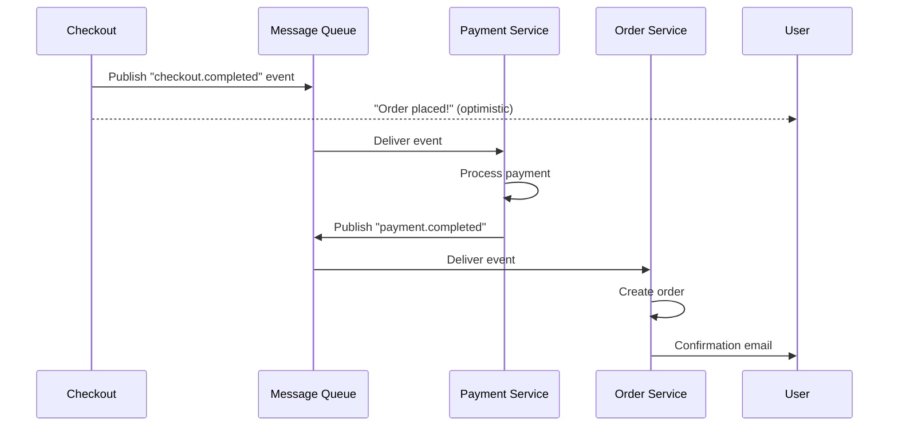

# RFC (Request for Comments)

Опциональный модуль для предложений, требующих командного обсуждения и консенсуса.

---

## Что такое RFC

**RFC** — предложение, открытое для обратной связи. У вас есть идея как решить проблему — новый сервис, редизайн API, миграция — и вместо прямой имплементации вы записываете это и приглашаете команду найти слабые места до коммитмента.

**Это НЕ**:
- PRD (продуктовые требования)
- ADR (фиксация принятого решения)
- Технический дизайн (это Approach)

**Это**:
- Техническое предложение с альтернативами
- Форум для обсуждения
- Документ для построения консенсуса
- Запись процесса принятия решения

---

## Когда создавать RFC

### Создавать когда:

1. **Нужен консенсус** — команда должна согласиться на подход
2. **Есть реальные альтернативы** — не "мы выбрали единственный вариант"
3. **Кросс-командное воздействие** — решение влияет на другие команды
4. **Большой риск** — решение сложно откатить
5. **Дорого или необратимо** — стоимость ошибки высока

### НЕ создавать когда:

- ❌ Решение очевидно (нет реальных альтернатив)
- ❌ Влияние локальное (одна команда)
- ❌ Прототип уже существует и работает
- ❌ Это просто фиксация решения (используйте ADR)
- ❌ Time pressure — нет времени на дебаты

---

## Структура RFC

### Шаблон

```markdown
# RFC-NNN: <Title>

- **Status**: Draft | In Review | Changes Requested | Approved | Rejected | Discarded
- **Author**: <name>
- **Created**: <date>
- **Review deadline**: <date>
- **Related PRD**: [link]
- **Related ADRs**: [links]

---

## Summary
[2-3 предложения: что предлагаем и зачем]

## Context and Problem
[Описание проблемы, которую решаем. Ссылка на Problem Statement.]

## Motivation
[Почему это важно сейчас. Что случится если не сделать.]

## Proposal
### Design
[Описание предлагаемого решения]

### Architecture
[Диаграммы, компоненты, взаимодействия]

### API Changes
[Описание изменений в API]

### Migration Plan
[Как переходим от текущего состояния к новому]

## Alternatives Considered

### Alternative 1: <Name>
**Description**: [описание]
**Pros**:
- [плюс 1]
- [плюс 2]
**Cons**:
- [минус 1]
- [минус 2]
**Why rejected**: [причина]

### Alternative 2: <Name>
**Description**: [описание]
**Pros**:
- [плюс 1]
- [плюс 2]
**Cons**:
- [минус 1]
- [минус 2]
**Why rejected**: [причина]

### Alternative 3: Do Nothing
**Pros**:
- Zero effort
- No risk of regression
**Cons**:
- Problem persists
- Competitive disadvantage

## Trade-offs and Risks

### Trade-offs
- [Что мы получаем и что теряем]

### Risks
| Risk | Likelihood | Impact | Mitigation |
|------|------------|--------|------------|
| [риск 1] | Medium | High | [митигация] |
| [риск 2] | Low | Critical | [митигация] |

## Open Questions
- [ ] [Вопрос 1 — кто отвечает, дедлайн]
- [ ] [Вопрос 2]

## Timeline
| Phase | Duration | Deliverable |
|-------|----------|-------------|
| RFC Review | 1 week | Approved/rejected |
| Implementation | 3 weeks | Working code |
| Testing | 1 week | QA sign-off |
| Rollout | 1 week | Production |

## References
- [Related documents]
- [External links]
```

---

## RFC Process (на основе [Attentive Engineering](https://tech.attentive.com/articles/rfc-process-for-teams))

### Принципы

1. **RFCs — инструменты для консенсуса**, не бюрократия
   - "Это направление, которое мы предлагаем. Что мы упускаем?"

2. **Начинайте рано, но не преждевременно**
   - Когда дизайн структурно завершён, но ещё не зафиксирован

3. **Избегайте вечных черновиков**
   - Документ, который никогда не покидает "Draft" — бесполезен

4. **Ограничивайте время ревью**
   - По умолчанию: 1 неделя для среднего RFC

5. **Авторы владеют результатом**
   - Авторы принимают или отклоняют фидбек

6. **Старшие инженеры — менторы**
   - Staff+ инженеры помогают авторам

### Жизненный цикл

```
Draft → In Review → Changes Requested → Approved
    ↘ Blocked / Discarded
```

| Статус | Описание |
|--------|----------|
| **Draft** | Начальная фаза написания |
| **In Review** | Готов для широкого фидбека |
| **Changes Requested** | Серьёзные замечания, нужны изменения |
| **Approved** | Ревью завершено, можно имплементировать |
| **Rejected** | Предложение отклонено |
| **Blocked** | Заблокировано внешними факторами |
| **Discarded** | Заброшено без решения |

---

## Пример RFC

```markdown
# RFC-004: Event-Driven Payment Processing

- **Status**: Approved
- **Author**: Bob Smith
- **Created**: 2025-01-10
- **Review deadline**: 2025-01-17
- **Related PRD**: [PRD: Checkout Improvements](../prd/checkout.md)

---

## Summary
We propose decoupling payment processing from checkout using an event-driven
architecture. Checkout will publish events to a message queue, and payment
processing will happen asynchronously.

## Context and Problem

### Current State
- Checkout → Payment → Order Creation (synchronous)
- Payment service latency: 2-5 seconds normally, 30+ under load
- During Black Friday: 3 outages, $500K revenue lost

### Problem Statement
See: [Problem Statement: Payment Outages](../specs/checkout/problem-statement.md)

## Motivation
- **Revenue**: $500K lost per outage event
- **Customer**: 8,000 failed orders during peak
- **Engineering**: 2 weeks firefighting, no feature work
- **Risk**: Will happen again next peak season

## Proposal

### Architecture


### Key Components
1. **Message Queue**: Redis Streams (already in use)
2. **Payment Worker**: Independent service, scalable
3. **Dead Letter Queue**: For failed payments
4. **Circuit Breaker**: Prevent cascading failures

### Migration Plan
1. **Phase 1**: Add event publishing to checkout (backward compatible)
2. **Phase 2**: Deploy payment worker, process new events
3. **Phase 3**: Migrate legacy payments to event-driven
4. **Phase 4**: Remove synchronous payment path

## Alternatives Considered

### Alternative 1: Keep Synchronous + Scale Up
**Description**: Add more instances of payment service
**Pros**:
- No architecture change
- Quick to implement
**Cons**:
- Still blocks checkout
- Cost scales linearly
- Doesn't solve fundamental issue
**Why rejected**: Doesn't address root cause

### Alternative 2: Use AWS Step Functions
**Description**: Managed workflow orchestration
**Pros**:
- Fully managed
- Built-in retry and error handling
**Cons**:
- Vendor lock-in
- More complex than needed
- Higher cost at scale
**Why rejected**: Over-engineered for our needs

### Alternative 3: Do Nothing
**Pros**:
- Zero effort
- No risk of regression
**Cons**:
- Problem persists
- Revenue loss continues
- Team morale impact
**Why rejected**: Unacceptable risk

## Trade-offs and Risks

### Trade-offs
- **Good**: Checkout no longer blocks on payment
- **Good**: Payment service scales independently
- **Bad**: Eventual consistency (user sees "placed" before payment confirmed)
- **Bad**: Additional operational complexity (queue, workers)

### Risks
| Risk | Likelihood | Impact | Mitigation |
|------|------------|--------|------------|
| Message loss | Low | Critical | Persistent queue + ack mechanism |
| Payment worker failure | Medium | High | Auto-restart + dead letter queue |
| Duplicate payments | Low | High | Idempotency keys |

## Open Questions
- [x] Should we use Redis Streams or RabbitMQ? → Redis (ADR-015)
- [x] What's the max retry count? → 3 with exponential backoff
- [ ] Should we offer "cancel payment" option? → Product decision by W3

## References
- [ADR-015: Use Redis Streams](../adr/adr-015.md)
- [Black Friday Postmortem](https://...)
- [Payment Processing Design](https://...)
```

---

## RFC → ADR

Когда RFC одобрен, создайте ADR:

```
RFC-004: Event-Driven Payment Processing (Approved)
    ↓
ADR-015: Use Redis Streams for payment events
ADR-016: Use circuit breaker pattern for payment processing
```

---

## AI-Agent Integration

### Prompt: Генерация RFC из проблемы

```
Based on this problem and context, generate an RFC:

Problem Statement: [paste]
Constraints: [list]
Current architecture: [brief description]

Generate RFC with:
1. Proposal (with architecture diagram)
2. At least 3 alternatives (including "do nothing")
3. Trade-offs and risks
4. Migration plan
5. Open questions
```

### Prompt: Ревью RFC

```
Review this RFC for:
1. Clarity: Is the proposal clear?
2. Completeness: Are alternatives fairly considered?
3. Feasibility: Can this be implemented?
4. Risks: Are all risks identified?
5. Migration: Is the plan realistic?

RFC:
[paste RFC content]
```

---

## Связь с другими модулями

### ← Problem Statement (вход)
**Как**: Проблема мотивирует RFC

### → ADR (выход)
**Как**: Одобренный RFC → один или несколько ADR

### → Approach (выход)
**Как**: После одобрения RFC создаётся Approach для реализации

### ← Requirements (вход)
**Как**: Требования определяют что решение должно покрывать

---

## Анти-паттерны

### ❌ Вечный черновик
**Проблема**: RFC никогда не покидает "Draft"
**Решение**: Time-box ревью, автор обязан завершить

### ❌ Стравление (Straw Man)
**Проблема**: Альтернативы не реальные, а для отвода глаз
**Решение**: Каждая альтернатива должна быть жизнеспособной

### ❌ Отсутствие фидбека
**Проблема**: Никто не ревьюит
**Решение**: Назначить ревьюеров, дедлайн

### ❌ Слишком поздно
**Проблема**: Код уже написан, а мы обсуждаем
**Решение**: "Начинайте рано, но не преждевременно"

---

## References

- [Attentive RFC Process](https://tech.attentive.com/articles/rfc-process-for-teams)
- [PRD vs ADR vs RFC](https://aridanemartin.dev/blog/prd-adr-rfc-decision-documents)
- [Oxide RFD Process](https://rfd.shared.oxide.computer/rfd/0001)
- [Rust RFC Process](https://github.com/rust-lang/rfcs)
- [Previous: PRD](./prd.md)
- [Next: BDD](./bdd.md)
- [Back to Modules Index](./README.md)
