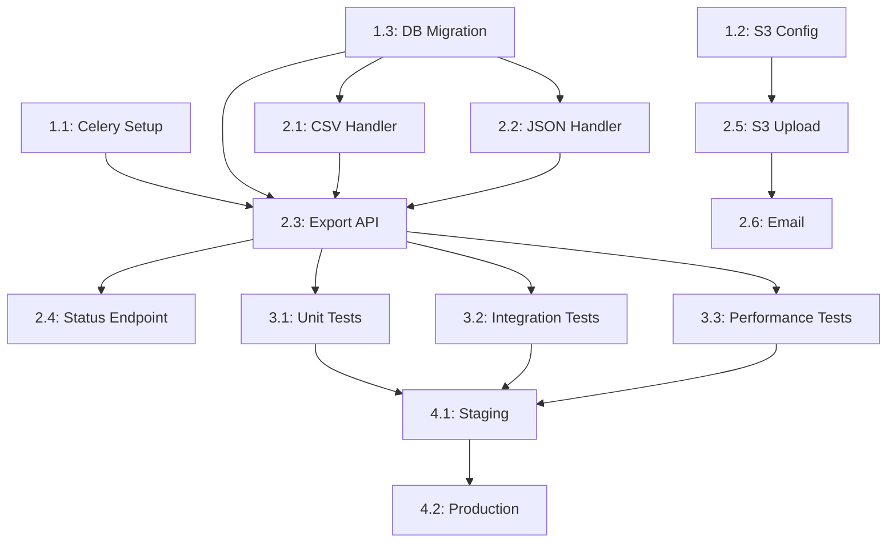
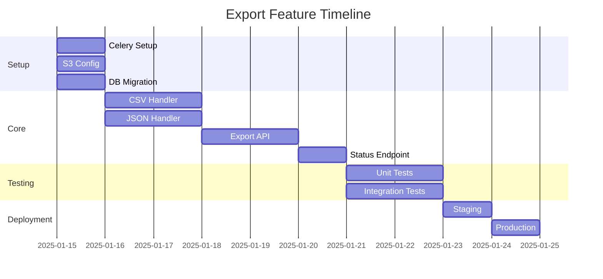

# Tasks Breakdown

Второй модуль **Execution Flow** (Phase 2). Tasks — это мост между Approach (как строить) и Implementation (написание кода). Разбиваем технический план на конкретные, оцениваемые, исполняемые единицы работы.

---

## Что такое Tasks Breakdown

**Tasks Breakdown** — структурированный список implementable задач, полученных из Approach. Каждая задача:
- **Конкретна** — понятно что делать
- **Независима** — можно сделать отдельно (или явно указаны зависимости)
- **Оцениваема** — можно оценить сложность
- **Проверяема** — есть чёткий критерий завершения
- **Соответствует** — покрывает требования и approach

**Это НЕ**:
- Requirements (что система должна делать)
- Approach (как система будет устроена)
- Код (реализация)
- Jira tickets (хотя могут быть синхронизированы)

**Это**:
- Мост между design и implementation
- Plan of record для команды
- Вход для AI-агентов при генерации кода
- Основа для estimation и planning

---

## Когда создавать Tasks

### Обязательно создавать когда:

1. **Проект > 1 день работы**
   - Нужна последовательность шагов
   - Несколько человек/агентов работают параллельно
   - Нужна оценка сроков

2. **Сложная задача с множеством компонентов**
   - Нужно разбить на управляемые части
   - Есть зависимости между частями
   - Нужен progress tracking

3. **AI-agent генерирует код**
   - AI needs clear, sequential instructions
   - Каждый шаг проверяем
   - Прогресс можно отслеживать

### НЕ создавать когда:

- ❌ Задача < 1 часа (сразу делайте)
- ❌ Очевидная последовательность
- ❌ Один человек делает всё за один присест
- ❌ Trivial changes

---

## Структура Tasks

### Lightweight Template

```markdown
# Tasks: <Feature Name>

## Overview
[1-2 предложения: что реализуем и на основе какого approach]

## Dependencies
- **Approach**: [link to approach.md]
- **Requirements**: [link to requirements.md]
- **ADRs**: [links to relevant ADRs]

## Tasks

### Phase 1: Setup
- [ ] Task 1.1: <description> (S/M/L)
- [ ] Task 1.2: <description> (S/M/L)

### Phase 2: Core Implementation
- [ ] Task 2.1: <description> (S/M/L)
- [ ] Task 2.2: <description> (S/M/L)

### Phase 3: Testing
- [ ] Task 3.1: <description> (S/M/L)

### Phase 4: Deployment
- [ ] Task 4.1: <description> (S/M/L)

## Parallelization
Tasks that can be done in parallel: [list]
Tasks with dependencies: [list with arrows]
```

### Full Template

```markdown
# Tasks: <Feature Name>

## Metadata
- **Author**: <name>
- **Status**: Draft | In Review | Approved | In Progress | Complete
- **Created**: <date>
- **Last Updated**: <date>
- **Approach**: [link to approach.md]
- **Requirements**: [link to requirements.md]
- **ADRs**: [links to relevant ADRs]

## Overview
[2-3 предложения: что реализуем, зачем, ключевые решения]

## Estimation Summary

| Phase | Tasks | Total Effort | Risk |
|-------|-------|--------------|------|
| Setup | 3 | 2 days | Low |
| Core Implementation | 8 | 5 days | Medium |
| Testing | 4 | 3 days | Medium |
| Deployment | 2 | 1 day | High |
| **Total** | **17** | **11 days** | |

## Tasks

### Phase 1: Setup & Infrastructure

#### Task 1.1: Setup Celery worker service
- **Description**: Create Celery worker infrastructure with Redis as broker
- **Acceptance Criteria**:
  - [ ] Celery configured with Redis broker
  - [ ] Worker process starts and connects to Redis
  - [ ] Health check endpoint responds
  - [ ] Logging configured (structured JSON)
- **Requirements covered**: REQ-EXP-004, REQ-EXP-011
- **Approach reference**: Section 4.1 (Async Processing)
- **Dependencies**: None
- **Estimate**: S (2-4 hours)
- **Risk**: Low
- **Assignee**: @alice / AI-agent
- **Status**: ⬜ Not Started

#### Task 1.2: Setup S3 client configuration
- **Description**: Configure S3 client for export file storage
- **Acceptance Criteria**:
  - [ ] S3 client initialized with credentials
  - [ ] Upload/download test passes
  - [ ] Lifecycle policy configured (7-day expiry)
  - [ ] Encryption configured (AES-256)
- **Requirements covered**: REQ-EXP-016, REQ-EXP-017
- **Approach reference**: Section 4.2 (File Storage)
- **Dependencies**: None
- **Estimate**: S (2-4 hours)
- **Risk**: Low
- **Assignee**: @bob / AI-agent
- **Status**: ⬜ Not Started

#### Task 1.3: Setup database migrations
- **Description**: Create migration for exports table
- **Acceptance Criteria**:
  - [ ] Migration script created
  - [ ] Table schema matches design.md
  - [ ] Indexes created
  - [ ] Migration runs successfully (up and down)
- **Requirements covered**: REQ-EXP-001 through REQ-EXP-018
- **Approach reference**: Section 2.4 (Data Model)
- **Dependencies**: None
- **Estimate**: S (2-4 hours)
- **Risk**: Low
- **Assignee**: @alice
- **Status**: ⬜ Not Started

### Phase 2: Core Implementation

#### Task 2.1: Implement CSV export handler
- **Description**: Create handler that streams user data as CSV
- **Acceptance Criteria**:
  - [ ] CSV handler accepts user_id and filters
  - [ ] Streams data in chunks (10,000 rows)
  - [ ] Handles special characters correctly
  - [ ] Memory usage < 512MB for large datasets
  - [ ] Unit tests pass (>80% coverage)
- **Requirements covered**: REQ-EXP-001, REQ-EXP-014, REQ-EXP-015
- **Approach reference**: Section 5.1 (Happy Path), Section 7.1 (Large Exports)
- **Dependencies**: Task 1.3 (database schema)
- **Estimate**: M (1-2 days)
- **Risk**: Medium (streaming implementation complexity)
- **Assignee**: @charlie / AI-agent
- **Status**: ⬜ Not Started

#### Task 2.2: Implement JSON export handler
- **Description**: Create handler that streams user data as JSON
- **Acceptance Criteria**:
  - [ ] JSON handler accepts user_id and filters
  - [ ] Streams data in chunks
  - [ ] Produces valid JSON (verified with jq)
  - [ ] Unit tests pass (>80% coverage)
- **Requirements covered**: REQ-EXP-002, REQ-EXP-014
- **Approach reference**: Section 5.1 (Happy Path)
- **Dependencies**: Task 1.3 (database schema)
- **Estimate**: M (1-2 days)
- **Risk**: Low
- **Assignee**: @charlie / AI-agent
- **Status**: ⬜ Not Started

#### Task 2.3: Implement export API endpoint
- **Description**: Create POST /api/exports endpoint
- **Acceptance Criteria**:
  - [ ] Endpoint accepts format and filters
  - [ ] Validates input (format must be csv/json)
  - [ ] Creates export record in database
  - [ ] Enqueues Celery task
  - [ ] Returns 202 with export_id
  - [ ] Integration tests pass
- **Requirements covered**: REQ-EXP-004
- **Approach reference**: Section 3.1 (API Contracts)
- **Dependencies**: Task 1.1 (Celery), Task 1.3 (database)
- **Estimate**: M (1-2 days)
- **Risk**: Low
- **Assignee**: @alice
- **Status**: ⬜ Not Started

#### Task 2.4: Implement status endpoint
- **Description**: Create GET /api/exports/{id} endpoint
- **Acceptance Criteria**:
  - [ ] Returns current status (pending/processing/completed/failed)
  - [ ] Returns download_url when completed
  - [ ] Returns file_size and expires_at
  - [ ] 404 for non-existent exports
  - [ ] 403 for other users' exports
- **Requirements covered**: REQ-EXP-007
- **Approach reference**: Section 3.1 (API Contracts)
- **Dependencies**: Task 2.3 (export endpoint)
- **Estimate**: S (2-4 hours)
- **Risk**: Low
- **Assignee**: @alice
- **Status**: ⬜ Not Started

#### Task 2.5: Implement S3 upload with retry
- **Description**: Upload export file to S3 with retry logic
- **Acceptance Criteria**:
  - [ ] Upload to S3 bucket
  - [ ] Retry 3x on failure with exponential backoff
  - [ ] Set encryption headers
  - [ ] Generate signed URL (7-day expiry)
  - [ ] Update database with file_url
- **Requirements covered**: REQ-EXP-016, REQ-EXP-017
- **Approach reference**: Section 6.2 (S3 Errors)
- **Dependencies**: Task 1.2 (S3 config)
- **Estimate**: M (1-2 days)
- **Risk**: Medium
- **Assignee**: @bob
- **Status**: ⬜ Not Started

#### Task 2.6: Implement email notification
- **Description**: Send email when export completes
- **Acceptance Criteria**:
  - [ ] Email sent on successful completion
  - [ ] Email contains download link
  - [ ] Queue notification if email service down
  - [ ] Retry for 24 hours
- **Requirements covered**: REQ-EXP-005
- **Approach reference**: Section 6.3 (Email Errors)
- **Dependencies**: Task 2.5 (S3 upload)
- **Estimate**: S (2-4 hours)
- **Risk**: Low
- **Assignee**: @bob / AI-agent
- **Status**: ⬜ Not Started

### Phase 3: Testing

#### Task 3.1: Write unit tests
- **Description**: Unit tests for all handlers and services
- **Acceptance Criteria**:
  - [ ] CSV handler tests (happy path + errors)
  - [ ] JSON handler tests
  - [ ] API endpoint tests
  - [ ] Coverage > 80%
- **Requirements covered**: All functional requirements
- **Approach reference**: Section 9.1 (Unit Tests)
- **Dependencies**: Phase 2 complete
- **Estimate**: M (1-2 days)
- **Risk**: Low
- **Assignee**: @charlie
- **Status**: ⬜ Not Started

#### Task 3.2: Write integration tests
- **Description**: Integration tests for full export flow
- **Acceptance Criteria**:
  - [ ] Full export flow test (request → download)
  - [ ] Error scenarios (timeout, retry, failure)
  - [ ] Concurrent exports test
- **Requirements covered**: REQ-EXP-004 through REQ-EXP-013
- **Approach reference**: Section 9.2 (Integration Tests)
- **Dependencies**: Phase 2 complete
- **Estimate**: M (1-2 days)
- **Risk**: Medium
- **Assignee**: @alice
- **Status**: ⬜ Not Started

#### Task 3.3: Performance tests
- **Description**: Load and stress tests for export service
- **Acceptance Criteria**:
  - [ ] 1000 concurrent exports test
  - [ ] 10M record export test
  - [ ] Meets REQ-EXP-014, REQ-EXP-015
- **Requirements covered**: REQ-EXP-014, REQ-EXP-015
- **Approach reference**: Section 9.4 (Performance Tests)
- **Dependencies**: Phase 2 complete
- **Estimate**: M (1-2 days)
- **Risk**: High (may reveal issues)
- **Assignee**: @bob
- **Status**: ⬜ Not Started

### Phase 4: Deployment

#### Task 4.1: Deploy to staging
- **Description**: Deploy feature to staging environment
- **Acceptance Criteria**:
  - [ ] All services deployed
  - [ ] Feature flags configured
  - [ ] Smoke tests pass
  - [ ] Monitoring dashboards configured
- **Approach reference**: Section 10.1 (Rollout Plan)
- **Dependencies**: Phase 3 complete
- **Estimate**: S (2-4 hours)
- **Risk**: Low
- **Assignee**: DevOps / @alice
- **Status**: ⬜ Not Started

#### Task 4.2: Production rollout
- **Description**: Deploy to production with canary
- **Acceptance Criteria**:
  - [ ] Canary deployment (5% traffic)
  - [ ] Monitor for 1 week
  - [ ] Full rollout after validation
  - [ ] Rollback plan documented
- **Approach reference**: Section 10.1 (Rollout Plan)
- **Dependencies**: Task 4.1 (staging)
- **Estimate**: S (2-4 hours) + monitoring time
- **Risk**: High
- **Assignee**: DevOps + @alice
- **Status**: ⬜ Not Started

## Dependency Graph



## Parallelization

**Can be done in parallel**:
- Task 1.1, 1.2, 1.3 (all setup, no dependencies)
- Task 2.1, 2.2 (both depend on 1.3, but independent of each other)
- Task 3.1, 3.2, 3.3 (all depend on Phase 2, but independent)

**Must be sequential**:
- Task 2.3 depends on 1.1 + 1.3 + 2.1 + 2.2
- Task 2.4 depends on 2.3
- Task 2.5 depends on 1.2
- Task 2.6 depends on 2.5
- Phase 4 depends on Phase 3

## Risk Register

| Task | Risk | Likelihood | Impact | Mitigation |
|------|------|------------|--------|------------|
| 2.1 | Streaming complexity | Medium | High | Prototype early, pair programming |
| 3.3 | Performance issues found | Medium | High | Early performance testing |
| 4.2 | Production issues | Low | Critical | Canary deployment, rollback plan |

## Open Questions

- [ ] Should we split CSV/JSON handlers into separate services?
- [ ] Do we need rate limiting on export API?
- [ ] What's the max concurrent exports per user?

## References

- [Approach](./approach.md)
- [Requirements](./requirements.md)
- [ADR-003: Use Celery](../adr/adr-003.md)
- [ADR-007: Use S3](../adr/adr-007.md)
```

---

## Estimation Guidelines

### Размеры задач

| Размер | Время | Пример |
|--------|-------|--------|
| **XS** | < 30 минут | Config change, typo fix |
| **S** | 2-4 часа | Setup task, simple endpoint |
| **M** | 1-2 дня | Feature component, handler |
| **L** | 3-5 дней | Complex component, integration |
| **XL** | > 1 неделя | ⚠️ Разбейте на подзадачи |

**Правило**: Если задача **XL**, разбейте её. Ни одна задача не должна быть больше 5 дней.

### Правила разбиения

1. **Каждая задача должна быть**:
   - Завершена за 1-2 дня
   - Имеет чёткий Definition of Done
   - Может быть протестирована отдельно
   - Может быть назначена одному человеку/агенту

2. **Зависимости должны быть явными**:
   - Укажите какие задачи должны быть завершены
   - Используйте dependency graph
   - Минимизируйте blocking dependencies

3. **Порядок должен быть логичным**:
   - Setup → Core → Testing → Deployment
   - Infrastructure → Business logic → UI
   - Backend → Frontend

---

## AI-Agent Integration

### Prompt: Генерация Tasks из Approach

```
Based on this technical approach, generate a detailed task breakdown:

Approach:
[paste approach.md content]

Requirements:
[paste requirements.md content]

Generate tasks.md with:
1. Phased structure (Setup, Core Implementation, Testing, Deployment)
2. For each task:
   - Clear description
   - Acceptance criteria (checkboxes)
   - Requirements covered (REQ-XXX references)
   - Approach reference (section number)
   - Dependencies
   - Estimate (S/M/L)
   - Risk level
3. Dependency graph (Mermaid)
4. Parallelization opportunities
5. Risk register

Rules:
- No task should be larger than 2 days
- Every requirement must be covered by at least one task
- Make acceptance criteria specific and testable
- Mark tasks suitable for AI-agent execution
```

### Prompt: Ревью Tasks

```
Review this task breakdown for:
1. Completeness: Are all requirements covered?
2. Correctness: Are dependencies correct?
3. Feasibility: Can each task be completed in estimated time?
4. Testability: Are acceptance criteria specific enough?
5. Parallelization: Are there missed parallelization opportunities?

Tasks:
[paste tasks.md content]

Requirements:
[paste requirements.md content]

Provide:
- Missing tasks (requirements not covered)
- Incorrect dependencies
- Tasks that should be split or merged
- Missing acceptance criteria
```

### Prompt: Execution Planning

```
Given these tasks and their dependencies, create an execution plan:

Tasks:
[paste tasks.md content]

Team: [number of developers/AI-agents]
Timeline: [target completion date]

Generate:
1. Day-by-day schedule
2. Who does what each day
3. Critical path analysis
4. Risk mitigation timeline
5. Checkpoints for review
```

---

## Connection to Other Modules

### ← Approach (вход)

**Как**: Approach определяет что нужно реализовать

```
Approach: "Use Celery for async processing"
    ↓
Tasks:
- Task 1.1: Setup Celery worker service
- Task 1.2: Configure Redis broker
- Task 2.1: Implement export task handler
```

### ← Requirements (вход)

**Как**: Requirements покрываются задачами

```
REQ-EXP-001: Export shall support CSV
REQ-EXP-002: Export shall support JSON
    ↓
Tasks:
- Task 2.1: Implement CSV handler (covers REQ-EXP-001)
- Task 2.2: Implement JSON handler (covers REQ-EXP-002)
```

### → Implementation (выход)

**Как**: Tasks определяют порядок реализации

```
Task 2.3: Implement export API endpoint
    ↓
Implementation:
@app.post("/api/exports")
async def create_export(request: ExportRequest):
    # Implementation based on task requirements
```

### → ADR (связь)

**Как**: Tasks могут требовать ADR

```
Task 2.5: Implement S3 upload
    ↓
Decision needed: S3 bucket structure?
    ↓
ADR-007: Use flat S3 structure with user prefixes
```

---

## Анти-паттерны

### ❌ Tasks Too Large

**Bad**:
```
- Task 1: Implement entire export feature (2 weeks)
```

**Good**:
```
- Task 1.1: Setup Celery worker (2 hours)
- Task 1.2: Implement CSV handler (1 day)
- Task 1.3: Implement JSON handler (1 day)
- Task 1.4: Implement API endpoint (1 day)
- Task 1.5: Implement S3 upload (1 day)
```

**Правило**: Максимум 2 дня на задачу. Если больше — разбейте.

---

### ❌ Missing Acceptance Criteria

**Bad**:
```
- Task 2.1: Implement export handler
```

**Good**:
```
- Task 2.1: Implement CSV export handler
  - [ ] Streams data in chunks (10,000 rows)
  - [ ] Handles special characters
  - [ ] Memory < 512MB for large datasets
  - [ ] Unit tests pass (>80% coverage)
```

**Правило**: Без acceptance criteria невозможно проверить завершение.

---

### ❌ No Dependencies

**Bad**: Все задачи в flat list без указания зависимостей

**Good**: Явные зависимости + dependency graph

**Правило**: Всегда указывайте зависимости. Это помогает планированию и параллелизации.

---

### ❌ Tasks Don't Cover Requirements

**Bad**: Requirements говорят о security, но нет задач для security

**Good**: Каждое требование покрыто хотя бы одной задачей

**Правило**: Используйте traceability (Requirements → Tasks).

---

### ❌ No Testing Tasks

**Bad**: Только implementation задачи, нет testing

**Good**: Отдельные задачи для unit, integration, performance tests

**Правило**: Testing — это не "после implementation", это отдельная фаза.

---

## Tools

### Task Management

**GitHub Issues**:
- Один issue per task
- Labels для приоритизации
- Milestones для phases
- Project boards для visualization

**Jira/Linear**:
- Epics для phases
- Stories для tasks
- Subtasks для breakdown
- Sprint planning

**Markdown (in repo)**:
- tasks.md как показано выше
- Git-based version control
- PR-based review
- AI-agent friendly

### Visualization

**Mermaid Gantt Chart**:


---

## Summary

**Tasks Breakdown** — это мост между Approach и Implementation. Ключевые принципы:

1. **Конкретность**
   - Каждая задача понятна без контекста
   - Acceptance criteria конкретны и проверяемы
   - Нет двусмысленности

2. **Полнота**
   - Все requirements покрыты
   - Все approach sections реализованы
   - Все edge cases учтены

3. **Управляемость**
   - Максимум 2 дня на задачу
   - Явные зависимости
   - Возможна параллелизация

4. **Прослеживаемость**
   - Task → Requirement mapping
   - Task → Approach section mapping
   - Task → Test mapping

5. **AI-Friendly**
   - Чёткие инструкции для агентов
   - Проверяемые результаты
   - Sequential execution

---

## References

- [GitHub Spec Kit Tasks](https://github.com/github/spec-kit) — `/speckit.tasks`
- [Kiro Tasks](https://kiro.dev/docs/specs/feature-specs) — tasks.md phase
- [OpenSpec](https://openspec.dev) — `/opsx:propose` generates tasks
- [Previous: Approach](./approach.md)
- [Next: Implementation](./implementation.md)
- [Back to Modules Index](./README.md)
